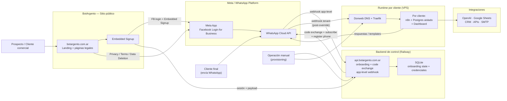
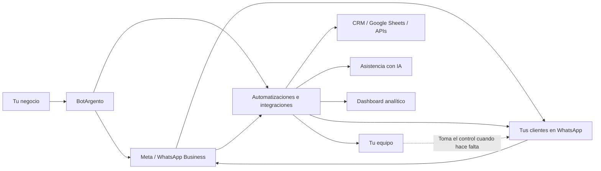
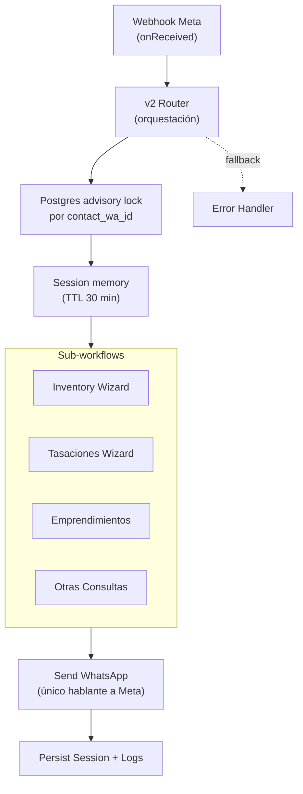
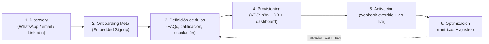
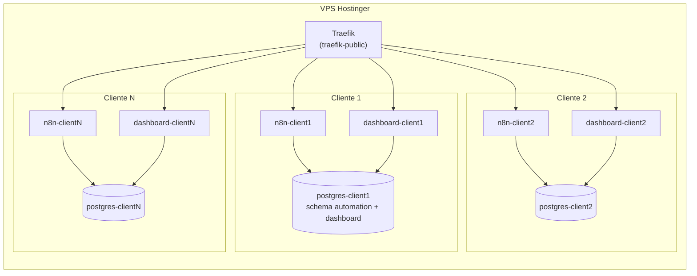

# BotArgento — Solución integral para clientes

Documento de presentación de la solución completa que BotArgento entrega a cada
cliente. Cubre los tres pilares del producto:

1. **Meta / WhatsApp Cloud API** — el canal oficial.
2. **WhatsApp Automation (n8n)** — el motor conversacional por cliente.
3. **Dashboard analítico** — la ventana operativa del cliente.

> Este archivo es la fuente para una futura presentación comercial. Está
> redactado en español neutro, en formato narrativo, listo para ser copiado y
> reformateado a slides.

---

## 1. ¿Qué entrega BotArgento?

BotArgento conecta el WhatsApp oficial del cliente con un asistente
automatizado que califica leads, responde consultas frecuentes, agenda y
escala a humanos cuando hace falta. Cada cliente recibe:

- **Un número WhatsApp Business oficial** conectado vía Meta Cloud API.
- **Un asistente automatizado a medida**, ejecutado en una instancia n8n
  aislada (un cliente = una base de datos = un contenedor).
- **Un dashboard web propio** en `dashboard.<cliente>.botargento.com.ar` con
  métricas en tiempo casi-real, exportación CSV y cola de seguimiento.
- **Onboarding guiado** mediante Meta Embedded Signup — sin pedirle al cliente
  que toque consolas técnicas.
- **Soporte y optimización continua** sobre los flujos conversacionales.

Diferenciales clave:

- Canal **oficial** (Meta Tech Provider), no scraping ni APIs no soportadas.
- **Aislamiento por cliente** a nivel red, base de datos y dominio.
- **Implementación a medida** del funnel, no un template genérico.
- **Activación en días**, no en meses.

---

## 2. Arquitectura end-to-end

Vista completa de la solución, desde el prospecto hasta el cliente final que
escribe por WhatsApp.



### Cómo se lee el diagrama

1. **Sitio público y capa de confianza.** `botargento.com.ar` aloja la landing
   y las páginas legales (Privacy, Terms, Data Deletion) requeridas por Meta.
2. **Onboarding Embedded Signup.** El cliente arranca el flujo desde el sitio.
   Meta valida la cuenta y devuelve el resultado al backend de BotArgento.
3. **Backend de control.** Es el plano de control: guarda estado de
   onboarding, identificadores Meta, credenciales cifradas. **No procesa
   tráfico de mensajes en runtime.**
4. **Webhook por defecto vs webhook por tenant.** El webhook por defecto a
   nivel app apunta al backend central. Una vez que el tenant está provisto,
   se activa un override que dirige los mensajes runtime al n8n del cliente.
5. **Provisioning manual.** Hoy la creación del tenant (subdominio + n8n +
   Postgres + dashboard) es operación manual. Está identificado como deuda
   para automatizar.
6. **Runtime por cliente.** Cada cliente tiene su propio subdominio, su propio
   n8n y su propia base Postgres aislada — incluyendo su dashboard.

---

## 3. Vista simplificada para el cliente



Lectura para el cliente:

- **Tu negocio** se conecta con BotArgento, que lo enlaza con WhatsApp oficial
  vía Meta.
- Los **mensajes entrantes** llegan a la automatización, que los califica,
  responde y deriva.
- **Tu equipo** sólo interviene cuando la automatización lo escala.
- Tenés un **dashboard propio** para ver volumen, intención, calidad de leads
  y cola de seguimiento.

---

## 4. Los tres pilares en detalle

### 4.1 Meta / WhatsApp Cloud API

- Canal oficial bajo el rol **Meta Technology Provider**.
- Onboarding mediante **Embedded Signup** (el cliente conserva su WABA y
  número).
- Soporta clientes con WABA existente o creación de nueva cuenta WhatsApp
  Business.
- BotArgento publica las páginas requeridas por Meta:
  - Privacy Policy
  - Terms of Service
  - Data Deletion
- Webhook a dos niveles:
  - **App-level:** apunta al backend central, captura eventos no-overridables
    (cuenta, calidad, etc.).
  - **Tenant-level (override):** una vez activado, los mensajes runtime van
    directo al n8n del cliente.

### 4.2 WhatsApp Automation (n8n)

Motor conversacional que vive en el VPS, una instancia por cliente. Hoy el
producto está documentado como **asistente inmobiliario general** (vertical
real-estate), pero el patrón es replicable a otros verticales.

#### Menú actual (vertical inmobiliaria)

```
1) Ventas
2) Alquileres
3) Tasaciones
4) Emprendimientos
5) Administración / Propietarios
6) Otras consultas
0) Menú principal
```

#### Comportamiento por flujo

- **Ventas / Alquileres:** wizard guiado (`zona → tipo → ambientes → precio →
  resultados`) sobre inventario en Google Sheets / Postgres. Resultados
  determinísticos, no alucinaciones de IA.
- **Tasaciones:** intake estructurado (tipo, ubicación, área) con derivación a
  humano + email + notificación interna por WhatsApp.
- **Emprendimientos:** listado read-only desde Google Sheets (`name`, `link`,
  `initial_investment`).
- **Administración / Propietarios:** ruteo directo con `wa.me` opcional.
- **Otras consultas:** handoff con descripción libre + notificación interna.

#### Diseño técnico



Reglas de diseño:

- El router **orquesta**; los child workflows tienen la lógica de dominio.
- El `send → persist` ocurre en ese orden: nunca se actualiza la sesión antes
  de confirmar el envío.
- Sólo el sender habla con la Graph API.
- Deduplicación por `message_id` y advisory lock por contacto reducen race
  conditions.

#### Persistencia (schema `automation`)

- `session_memory` — estado conversacional efímero.
- `lead_log` — log de mensajes entrantes/salientes.
- `escalations` — handoffs y errores.
- `inventory` — espejo del inventario.
- `reporting_sync_state` — watermarks del sync a Sheets.
- Vistas compartidas: `v_daily_metrics`, `v_flow_breakdown`,
  `v_contact_summary`, `v_handoff_summary`, `v_follow_up_queue`.

#### Reporting

- **Postgres es la fuente de verdad.** Las vistas son la definición canónica.
- **Google Sheets de reporting** se refresca cada 10 minutos (raw + summary
  tabs).
- **Email diario 08:00 BA-time** con resumen de ayer.
- El dashboard web (sección 4.3) reemplaza a la planilla como UI primaria.

### 4.3 Dashboard analítico

Aplicación Next.js 15 (App Router) + TypeScript + Tailwind v4 + shadcn/ui +
Recharts, desplegada por cliente en `dashboard.<clienteN>.botargento.com.ar`.

#### Páginas

- **Overview** — KPIs principales, tendencia 14 días, breakdown por intent.
- **Conversations** — tabla TanStack con filtros via URL (compartibles).
- **Handoffs** — escalaciones por destino y tipo.
- **Follow-up** — cola priorizada (`high` / `medium` / `low`).
- **Login** — magic link vía Resend, allowlist en `dashboard.allowed_emails`.

#### Reglas no negociables

1. El dashboard **nunca** escribe sobre `automation.*` — el rol
   `dashboard_app` tiene SELECT-only. Las escrituras sólo tocan
   `dashboard.*`.
2. **Sin strings hardcoded** en JSX — todas las labels vienen de
   `verticalConfig` / `tenantConfig`.
3. **Server Components por default** — fetching desde el server, nada de
   client-side data fetching.
4. **Toda acción auth-relevante** se loguea en `dashboard.audit_log` (logins,
   denials, exports CSV).
5. **Tokens magic-link SHA-256 hasheados** antes de persistir.
6. **Migrations aditivas** — sin DROP destructivos.
7. **Env vars Zod-validados al boot** — fail fast, no a request time.
8. **Secrets fuera de Git**, viven en `/opt/n8n/<clienteN>/dashboard.env`.

#### Branding por cliente (white-label)

Variables `CLIENT_*`:

- `CLIENT_NAME` — nombre legal/comercial.
- `CLIENT_LOGO_URL` — logo en `/opt/n8n/<clienteN>/assets/logo.svg`.
- `CLIENT_PRIMARY_COLOR` — color de acento + chart primario.
- `CLIENT_TIMEZONE` — default `America/Argentina/Buenos_Aires`.
- `CLIENT_LOCALE` — default `es-AR`.

#### Despliegue

- **Imagen Docker:** `ghcr.io/jperez1804/dashboard:<tag>`.
- **Compose:** `dashboard.compose.yml` por cliente, en `/opt/n8n/<clienteN>/`.
- **Workflow GitHub Actions → Deploy** con `tenant=all|<cliente>` y
  `tag=latest|<sha>`.
- **Rollback:** mismo workflow con tag anterior. ~2 min round-trip.
- **Health:** entrypoint corre `verify-view-compat.mjs` — el contenedor falla
  rápido si faltan vistas requeridas.

---

## 5. Customer journey



| Etapa | Quién | Output |
|---|---|---|
| Discovery | BotArgento + cliente | Alcance, vertical, integraciones |
| Onboarding Meta | Cliente (guiado) | WABA + phone conectados |
| Definición de flujos | BotArgento + cliente | Mapa de flujos + reglas |
| Provisioning | BotArgento | Subdominio + runtime + dashboard |
| Activación | BotArgento | Webhook override + smoke tests |
| Optimización | BotArgento | Iteración sobre métricas reales |

---

## 6. Modelo de aislamiento por cliente



- Una network Docker compartida (`traefik-public`) sólo para el reverse proxy.
- Cada cliente vive en su propia network interna: `n8n-<clienteN>-internal`.
- El dashboard se conecta al Postgres del cliente con un rol de menor
  privilegio (`dashboard_app`, SELECT-only sobre `automation.*`).

---

## 7. Datos, privacidad y trust

### Categorías de datos

- **Contacto:** nombre, número WhatsApp, email opcional.
- **Conversación:** mensajes, audio, imágenes, documentos, preferencias,
  historial.
- **Metadata técnica:** timestamps, idioma, logs, identificadores de
  navegador/dispositivo.
- **Transaccional opcional:** consultas de productos/servicios, reservas,
  pagos (procesadores externos).

### Compromisos públicos

- No se envía spam no solicitado — requiere iniciación del usuario o consent.
- Opt-out vía `BAJA` o `STOP`.
- No se venden datos personales.
- BotArgento actúa como **procesador** (no controlador) cuando opera en
  nombre del cliente comercial.
- Página pública de eliminación de datos (`info@botargento.com.ar` o
  `privacy@botargento.com.ar`).

### Auditoría operativa

- Todo login, intento denegado y exportación CSV se loguea en
  `dashboard.audit_log`.
- Magic links expiran en 15 min; los tokens se almacenan SHA-256.
- Rate limit en exports (10/min/sesión).

---

## 8. Estado actual vs roadmap

### En producción / live

- Sitio público, landing y páginas legales.
- Onboarding Embedded Signup (UI + parte del backend).
- Runtime n8n vertical inmobiliaria.
- Reporting pipeline (Postgres → Sheets + email diario).
- Dashboard web por cliente (auth, overview, handoffs, follow-up, exports).
- Provisioning manual de tenants.

### Planificado / parcial

- Backend de control completo (Railway) para gestión de credenciales y
  webhook override automatizado.
- Provisioning automatizado de tenants.
- Dashboard de operaciones internas para BotArgento (gestión de tenants y
  onboarding).
- Verticales adicionales más allá de inmobiliaria.

---

## 9. Stack técnico (resumen)

| Capa | Tecnología |
|---|---|
| Landing & legales | HTML/CSS estáticos, Geist + Sora |
| Backend de control | Node.js + TypeScript + Hono + Drizzle + SQLite, en Railway |
| Runtime conversacional | n8n self-hosted, Postgres 16 |
| IA | OpenAI GPT (cuando aplica) |
| Dashboard | Next.js 15 + TS strict + Tailwind v4 + shadcn/ui + Recharts + TanStack Table + Drizzle + Auth.js v5 (Resend) |
| Infra | Hostinger VPS + Docker Compose + Traefik + Donweb DNS |
| Imágenes | GitHub Container Registry (`ghcr.io/jperez1804/*`) |
| CI/CD | GitHub Actions (Release + Deploy por SSH) |

---

## 10. Deuda técnica y pendientes documentales

> Esta sección sirve doble propósito: tracking interno + transparencia con el
> cliente.

### Deuda de producto

1. **Inventario runtime sigue leyendo Google Sheets.** El sync a Postgres
   existe pero el wizard live aún no consulta `automation.inventory`.
2. **Calificación post-resultados es superficial.** Falta agendamiento,
   captura de datos contractuales, scoring.
3. **Handoff inconsistente entre flujos.** `Tasaciones` y `Otras consultas`
   tienen notificación interna; el resto, no.
4. **`automation.escalations` mezcla handoffs con errores.** Necesita un
   discriminador `escalation_type` o tablas separadas.
5. **Provisioning manual de tenants.** Cada nuevo cliente requiere ~15 min de
   operación manual sobre el VPS.

### Deuda de plataforma

6. **Backend de control parcial.** El blueprint está; falta cerrar
   credentials rotation, admin endpoints, override automatizado.
7. **Sin staging.** v1 valida deploy contra un canary tenant primero si el
   cambio es riesgoso.
8. **Reporting visual previo (Sheets dashboard prototype) descontinuado.** El
   dashboard web lo reemplaza pero el código Python queda como referencia.

### Deuda comercial / operativa

9. **Pricing no está documentado** en el repo público (sólo tiers Starter /
   Pro / Enterprise con CTA).
10. **SLA de soporte y horario de cobertura** no están formalizados.
11. **KPIs internos del negocio** (no del cliente) no están definidos.

### Deuda documental

12. **🟡 Migración de este documento a PPT.** Este `clients.md` es la fuente
    para una presentación comercial en PowerPoint. Pendiente:
    - Convertir cada sección numerada a un slide (o grupo de slides).
    - Renderizar los diagramas Mermaid como imágenes embebibles.
    - Aplicar el branding visual de BotArgento (paleta `#75aadb` / `#e8b84b`,
      Geist + Sora, fondo glassmorphism oscuro como la landing).
    - Versión corta (deck comercial, ~10 slides) y versión larga (deck
      técnico, ~25 slides).
    - Definir si se mantiene este `.md` como sincronizado con el `.pptx` o si
      el `.pptx` pasa a ser fuente de verdad después de la primera migración.
13. **Documentación drift histórico.** Algunas notas viejas describen como
    "live" cosas que aún están planificadas — los READMEs actuales corrigen
    eso pero el deck nuevo no debe arrastrar ese drift.

---

## Anexo — Referencias cruzadas

| Documento | Ubicación | Rol |
|---|---|---|
| Dashboard README | `botargento-dashboard/README.md` | Operación + provisioning del dashboard |
| Dashboard rules | `botargento-dashboard/CLAUDE.md` | Reglas no-negociables del dashboard |
| Dashboard blueprint | `botargento-dashboard/docs/BLUEPRINT.md` | Diseño arquitectónico |
| n8n WhatsApp README | `whatsapp-automation-claude/README.md` | Runtime conversacional |
| n8n Postgres setup | `whatsapp-automation-claude/postgres-setup.sql` | Schema + vistas |
| Architecture E2E | `landingpage/BOTARGENTO-ARCHITECTURE.md` | Diagrama global |
| Business handbook | `landingpage/BUSINESS.md` | Contexto comercial |
| Privacy / Terms / Data deletion | `landingpage/privacy.html` etc. | Compliance Meta |
