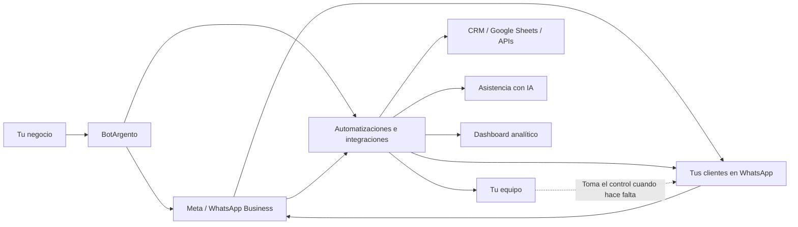

# BotArgento — Tu negocio responde solo

> Documento fuente para el one-pager comercial. Estructura pensada para
> renderizarse como HTML con la misma identidad visual del landing
> (`botargento.com.ar`). Cada `##` mapea a una sección visual.

---

## 1. Automatizá WhatsApp e Instagram. Tu negocio responde solo.

BotArgento responde consultas, califica oportunidades y deriva a tu equipo
cuando hace falta. IA, flujos y reglas de negocio operando 24/7 sobre tus
canales.

`Meta Technology Provider · WhatsApp Cloud API oficial · OpenAI GPT`

---

## 2. Sobre mí

Soy **Jonatan Perez**, fundador de BotArgento.

Tengo **más de diez años de experiencia como desarrollador**, con foco en
integraciones, automatización y sistemas de negocio, y una base sólida en
tecnologías del ecosistema **Microsoft**.

Actualmente trabajo en proyectos para **IDB Bank**, en entornos donde la
calidad técnica, la trazabilidad y la confiabilidad operativa son
fundamentales. Esa experiencia es parte de lo que aplico en BotArgento:
soluciones serias, bien integradas y pensadas para funcionar en producción.

BotArgento combina esa experiencia con herramientas modernas como
**WhatsApp Cloud API oficial**, **Meta Embedded Signup**, **automatizaciones
con n8n**, **integraciones con CRM y APIs** e **IA aplicada a conversaciones
reales**.

Trabajo personalmente en cada implementación, para que no hables con un
intermediario comercial sino con quien diseña, conecta y pone en marcha la
solución.

El objetivo es simple: que tu negocio responda más rápido, ordene mejor sus
oportunidades y dependa menos de tareas manuales.

---

## 3. Status

```
UPTIME    24/7      activo sin pausas
DEPLOY    < 15 d    hasta activación
PARTNER   Meta      technology provider
LATENCY   < 1 s     primera respuesta
```

---

## 4. Lo que resuelve

- **Respuestas lentas → leads fríos.** El 80% de los contactos espera
  respuesta en menos de 10 minutos. Si no llegás, la oportunidad se va al
  competidor que sí llegó.
- **Canales dispersos → operación a ciegas.** WhatsApp, Instagram, web,
  llamadas. Sin un lugar único, no sabés cuántas consultas entraron, ni
  cuáles se convirtieron, ni dónde se cayó el lead.
- **Equipo saturado por preguntas repetidas.** Tu gente respondiendo
  "¿cuánto sale?" y "¿dónde están?" todo el día, en lugar de cerrar
  operaciones.

---

## 5. Cómo funciona — tres fases

**Fase 1 — Conectá tus canales.** Instagram, WhatsApp u otros canales. La
conexión es guiada con Embedded Signup de Meta — sin código, sin tocar
consolas técnicas. Conservás tu número y tu cuenta.

**Fase 2 — Definí reglas y flujos.** FAQs, formularios, criterios de
calificación y cuándo derivar al equipo humano. Todo a medida de tu
operación, no un template genérico.

**Fase 3 — Activá y optimizá.** Salís en vivo, medís resultados desde el
dashboard y ajustamos la automatización según lo que pasa de verdad en tu
negocio.

---

## 6. Vista simple



Tu negocio se conecta con BotArgento, que lo enlaza con WhatsApp oficial vía
Meta. Los mensajes entrantes llegan a la automatización, que los califica,
responde y deriva. Tu equipo sólo interviene cuando la automatización lo
escala. Y tenés un dashboard propio para ver todo en vivo.

---

## 7. Se adapta a tu negocio

La misma plataforma se configura para cualquier vertical. Cambia el guion
conversacional, no el motor.

- **Inmobiliarias** *(caso de referencia en producción)* — ventas,
  alquileres, tasaciones, emprendimientos.
- **Estudios de arquitectura** — intake de proyectos, agenda de visitas,
  presupuestos preliminares.
- **Clínicas y consultorios** — turnos, recordatorios, derivación por
  especialidad.
- **Gimnasios y wellness** — inscripciones, planes, recuperación de socios.
- **Servicios profesionales** — calificación de prospects, agenda,
  derivación al socio adecuado.
- **Retail y e-commerce** — consultas de stock, seguimiento de pedidos,
  postventa.

BotArgento es el primer caso productivo (real estate). Si tu vertical no
está acá, lo armamos.

---

## 8. Lo que recibís

- **Un número WhatsApp Business oficial en Meta** *(propiedad del cliente)*,
  conectado vía Meta Cloud API.
- **Un asistente automatizado a medida** para tu negocio y tu funnel.
- **Un dashboard web propio** en `dashboard.<tu-empresa>.botargento.com.ar`
  con métricas en vivo, exportación CSV y cola de seguimiento.
- **Onboarding guiado** con Embedded Signup de Meta — sin pedirte que
  toques consolas técnicas.
- **Soporte y optimización continua** sobre los flujos.

---

## 9. Por qué BotArgento

- **Canal oficial.** Somos Meta Technology Provider — WhatsApp Cloud API,
  no scraping ni APIs no soportadas. Tu cuenta nunca queda en riesgo.
- **Aislamiento por cliente.** Cada negocio corre en su propia red, base
  de datos y dominio. Tus datos no se mezclan con los de otros clientes.
- **Implementación a medida.** No es un bot genérico con plantillas. El
  funnel se diseña con vos.
- **Activación en días, no en meses.** Menos de 15 días hábiles desde la
  firma hasta el go-live.

---

## 10. Un plan claro para automatizar tu operación

Una sola propuesta mensual para negocios que quieren responder más rápido,
ordenar leads y conectar sus canales con una implementación guiada.

**ARS 100.000 / mes**
*Oferta de lanzamiento — primer mes ARS 50.000 · instalación y guía sin
costo.*

Incluye:

1. Respuestas automáticas con IA y flujos a medida
2. Captura y calificación de leads
3. Derivación a humano cuando haga falta
4. Integraciones con CRM, Google Sheets, agenda
5. Ajustes orientados a tu operación real
6. *(bonus)* Instalación, configuración inicial y guía personalizada de uso

---

## 11. Próximos pasos

Una vez que decidimos avanzar, así trabajamos:

1. **Onboarding de WhatsApp.** Conectamos tu número con la Cloud API oficial
   vía Embedded Signup de Meta. Vos seguís siendo dueño del número y de la
   cuenta.
2. **Análisis de tu operación.** Revisamos cómo entran las consultas hoy,
   qué se repite, qué se cae y qué tendría que pasar para que cada lead
   termine en una conversación útil.
3. **Definición de flujos.** Diseñamos el guion conversacional, los puntos
   de calificación, los criterios de derivación y las integraciones
   necesarias.
4. **Aprobación de flujos.** Te mostramos cada flujo antes de activarlo. No
   sale nada en vivo sin tu visto bueno.
5. **Implementación y go-live.** Configuramos, probamos y activamos. A
   partir de ahí, medimos resultados y ajustamos sobre lo que pasa de
   verdad en tu operación.

---

## 12. ¿Dudas?

Escribime y lo charlamos. Sin compromiso, sin venta agresiva — 30 minutos
para revisar tu operación y ver si tiene sentido avanzar.

**→ Agendar una llamada** — `https://calendar.app.google/xtAn39HqKc7nDYmA7`

---

## Anexo — Identidad visual (para el render HTML)

El one-pager HTML debe replicar la estética del landing
(`botargento.com.ar`): dark glassmorphism, frames HUD, scan lines sutiles,
acento azul + dorado. Tokens canónicos:

| Token | Valor | Uso |
|---|---|---|
| `--primary` | `#75aadb` | Acento principal, signal dots, focos |
| `--accent` | `#e8b84b` | Acento secundario, brackets, highlights |
| `--success` | `#3fdba8` | Callouts positivos (uptime, online) |
| `--bg-1` | `#04091a` | Canvas |
| `--bg-2` | `#050e1f` / `#081530` | Superficies de cards |
| `--text` | `#e8eefb` | Cuerpo |
| `--muted` | `#8a9dbe` | Captions, copy secundario |
| Display | **Sora** 600 / 700 / 800 | Headlines |
| Body | **Geist** 300 – 700 | Párrafos, listas |
| Mono | **JetBrains Mono** | Kickers, status strip, numéricos |
| Texturas | Grid 24px + scan lines 3px @ ~3% + glows radiales | Background |
| Esquinas | 4px radius, bracket frames HUD | Cards |

Voz: castellano neutro, founder-led, práctica, sin jerga corporativa.
Misma tonalidad que el landing en producción.
