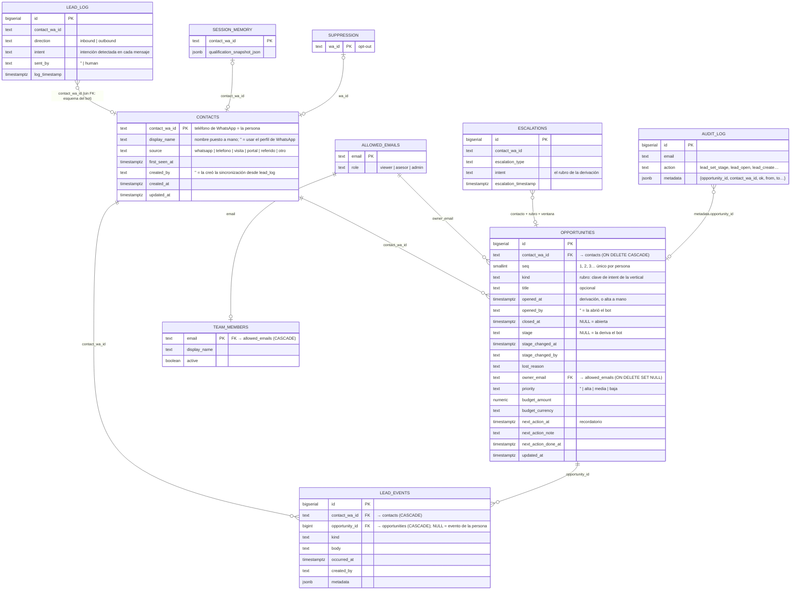

# CRM: una persona, N oportunidades

Este documento es la fuente de verdad de las reglas de negocio del CRM. Si una regla cambia,
se cambia acá en el mismo PR.

## Por qué

Hasta la migración `0010` un lead **era** la persona: `dashboard.lead_state` tenía el teléfono
como clave primaria. Una persona que alquilaba, cerraba su ficha y meses después preguntaba
por una venta no tenía a dónde ir: la tarjeta cerrada seguía cerrada y la consulta nueva era
invisible.

Ahora hay dos ideas separadas:

- **Contacto**: la persona, identificada por su teléfono de WhatsApp.
- **Oportunidad**: un proceso comercial, con su etapa, responsable, prioridad, presupuesto,
  recordatorio, motivo de pérdida y actividad. Una persona puede tener varias, en el tiempo o
  en paralelo.

En el panel, la pestaña sigue llamándose **Leads** y **cada tarjeta del tablero es una
oportunidad**. La ficha de la persona lista todas las suyas.

## Reglas

### Personas y oportunidades

1. La persona es el teléfono (`contact_wa_id`). Tiene 0..N oportunidades, numeradas 1, 2, 3…
   en el orden en que se abrieron. Toda persona que escribió al bot o fue cargada a mano
   existe como contacto, **tenga o no oportunidades**.
2. Cada oportunidad tiene su propia etapa, responsable, prioridad, presupuesto, recordatorio,
   motivo de pérdida y actividad. Lo que es de la persona (nombre, origen, lo que captó el
   bot, el opt-out, la conversación de WhatsApp) se comparte entre todas.
3. Una oportunidad está **abierta** mientras `closed_at` es nulo, y **cerrada** cuando un
   asesor la pasó a Cerrado o Perdido. Moverla a una etapa no terminal la reabre. La pérdida
   por inactividad (regla 14) es un estado derivado y reversible: **no** la cierra.
4. Cada oportunidad lleva un **rubro** (Ventas, Alquileres, Tasaciones, Emprendimientos,
   Administración, Otras), siempre editable desde la ficha.

### Qué crea una oportunidad

> Una derivación por rubro es una oportunidad.

5. **Derivación del bot** de rubro R para una persona que **no tiene ninguna oportunidad
   abierta de rubro R** → se abre sola, en **Calificado**, con la fecha de la derivación.
   Vale si nunca tuvo ninguna, si las de ese rubro están cerradas, o si tiene abiertas de
   otros rubros. Ejemplo: derivación por Alquileres y después por Otras consultas → dos
   oportunidades, cada una con lo suyo.
6. **Derivación de rubro R con una oportunidad abierta de rubro R** → cuenta para esa: la
   empuja a Calificado si estaba antes y reinicia su reloj de inactividad. No abre otra.
7. **Mensajes sin derivación** no crean nada. Cuentan como actividad de la persona: mantienen
   vivas **todas** sus oportunidades abiertas. Si traen una intención de un rubro que nadie
   está trabajando, la tarjeta muestra «Consulta nueva: {rubro}» con un botón para abrirla en
   un click. Ejemplo: tiene abierta una de Otras y empieza el flujo de Alquileres sin
   terminarlo.
8. **Persona que escribió y nunca derivó** → no tiene oportunidad. Aparece en Conversaciones
   con el filtro **«Sin derivar»** y el botón «Abrir oportunidad»; Leads muestra «N sin
   derivar esta semana».
9. **A mano**: «Nuevo lead» (persona que no vino por WhatsApp, rubro obligatorio) crea la
   persona y su oportunidad 1 en Nuevo. «Nueva oportunidad» desde la ficha abre otra en
   paralelo. Ambas quedan asignadas a quien las abre y registran el evento «Oportunidad
   abierta».
10. **Opt-out**: todas las oportunidades de la persona se ven Perdidas, no es reversible y no
    se abre ninguna, ni sola ni a mano.

### Etapas y señales del bot

11. La etapa automática se deriva de las señales dentro de la ventana de la oportunidad
    (`[opened_at, closed_at)`): derivación de su rubro → Calificado; respuesta humana →
    Contactado; si no, Nuevo. Un asesor puede mover a cualquier etapa; el bot solo empuja
    hacia adelante y nunca saca de una etapa terminal puesta por una persona. Las
    oportunidades del bot nacen en Calificado; **Nuevo** queda para las manuales.
12. **Atribución.** Una derivación cuenta solo para la oportunidad de su rubro y nunca empuja
    a las de otro. Un mensaje de la persona, un mensaje del bot y una respuesta humana
    cuentan como actividad para **todas** sus oportunidades abiertas: nada en los datos dice
    de cuál hablaban, y contar de más nunca pierde un lead. Las actividades que carga un
    asesor van exactas a la oportunidad donde las cargó.
13. El rubro de una derivación sale de `escalations.intent`, y si falta, de
    `escalation_type`; el de un mensaje, de `lead_log.intent`. El mapeo a rubro es el mismo
    que usan el Panel y el chip de intención (`src/lib/crm/intent.ts`). Tokens sin valor
    comercial, como `menu`, no mapean a ningún rubro y por eso no pueden abrir nada.
14. Una oportunidad abierta sin actividad durante `autoLostDays` (30) se ve como **Perdida
    por inactividad**, reversible; `warnDays` (7) antes aparece «Se pierde el…». Cuenta como
    actividad: mensajes de WhatsApp, notas/llamadas/visitas/reuniones, cambios de etapa,
    contactos desde el panel y la apertura de la oportunidad. Asignar responsable, prioridad,
    presupuesto o recordatorio **no** cuenta.

### Equipo y permisos

15. Solo entra al panel quien está en `allowed_emails`; un miembro del equipo existe solo si
    está en esa lista (clave foránea con borrado en cascada). Responsable de una oportunidad
    solo puede ser un miembro activo con rol asesor o admin.
16. Un asesor gestiona las oportunidades sin responsable y las suyas; reasignar la de un
    colega es de admin. Viewer solo lee.

### Resumen

17. «Cerrados» cuenta oportunidades cerradas dentro de la ventana de 7 días; «Nuevos», las
    abiertas en la ventana; «Origen» cuenta **personas**, no oportunidades.

## Modelo de datos

`automation.*` y `outreach.*` son del bot y el panel **solo los lee**. Por eso no hay clave
foránea hacia `lead_log`: es un esquema ajeno y no tiene clave única por contacto.

## Sincronización en lectura

`src/lib/queries/opportunity-sync.ts` corre al principio de cada lectura del CRM:

1. `ensureContacts` — crea el contacto de quien escribió al bot y todavía no estaba.
2. `fillMissingKinds` — le pone rubro a las oportunidades migradas sin uno, tomándolo de la
   primera derivación dentro de su ventana.
3. `ensureOpportunities` — abre una oportunidad por cada par (persona, rubro) con una
   derivación que ninguna oportunidad cubre.

Las tres sentencias son idempotentes (`ON CONFLICT DO NOTHING` contra los índices únicos de
la migración `0010`), así que dos renders simultáneos no duplican nada. La sincronización
**nunca** escribe `lead_events`: la apertura automática queda registrada por el `opened_at`
de la propia oportunidad; solo la apertura manual agrega un evento.

No hay disparador más limpio: el bot escribe `automation.*` a través de n8n, así que el panel
no tiene un hook ahí, y un trigger en la base sería DDL sobre un esquema que solo leemos.

## Riesgos aceptados

| Riesgo | Qué puede pasar | Por qué se acepta |
|---|---|---|
| Mensajes ambiguos | Un «hola» o una respuesta del asesor reinician el reloj de inactividad de todas las oportunidades abiertas de la persona | Nunca deja morir una oportunidad por atribuir mal; las derivaciones sí van exactas |
| Quien no deriva no está en el tablero | Una consulta abandonada solo se ve en Conversaciones y en el contador de Leads | Menos ruido con mucho flujo; volver atrás es una regla más en la sincronización |
| Dos aperturas simultáneas | Una persona con dos oportunidades abiertas del mismo rubro | El índice único lo evita entre automáticas, y la manual reintenta una vez |
| Costo de la sincronización | Un agregado indexado por cada apertura de Leads | Milisegundos con los volúmenes de un tenant; se puede limitar por frecuencia si crece |
| Claves terminales fijas en la migración | El backfill nombra `cerrado`/`perdido` a mano | SQL no puede leer la configuración de la vertical, y solo inmobiliaria tiene CRM |
| Rubro sin mapear | Una derivación con un tipo nuevo cae en «Otras» | Se ve en el tablero y se corrige editando el rubro o la vertical |
