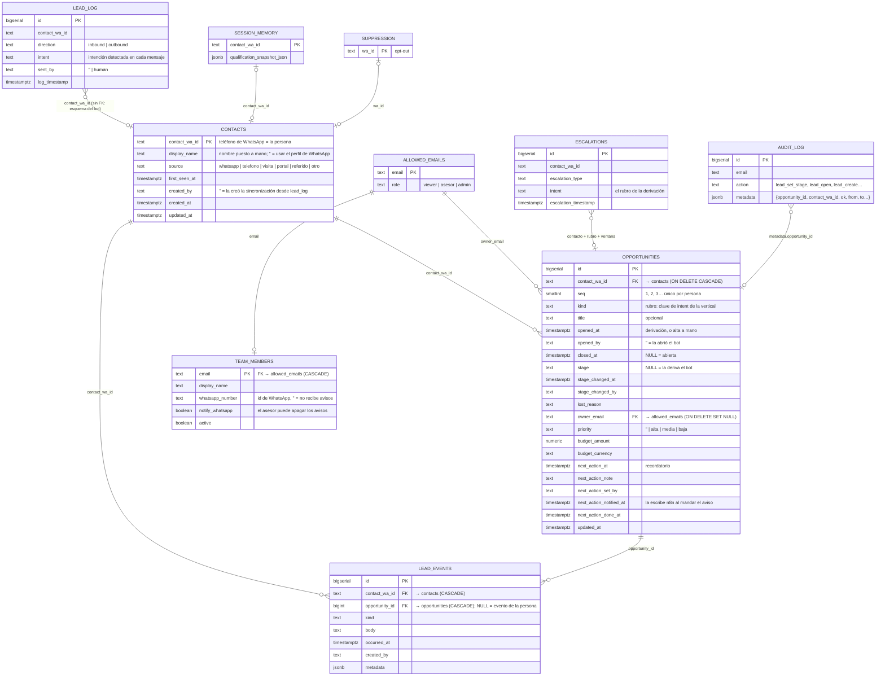

# CRM: una persona, N oportunidades

Este documento es la fuente de verdad de las reglas de negocio del CRM. Si una regla cambia,
se cambia acá en el mismo PR.

## Por qué

Hasta la migración `0010` un lead **era** la persona: `dashboard.lead_state` tenía el teléfono
como clave primaria. Una persona que alquilaba, cerraba su ficha y meses después preguntaba
por una venta no tenía a dónde ir: la tarjeta cerrada seguía cerrada y la consulta nueva era
invisible.

Ahora hay dos ideas separadas:

- **Contacto**: la persona, identificada por su teléfono de WhatsApp.
- **Oportunidad**: un proceso comercial, con su etapa, responsable, prioridad, presupuesto,
  recordatorio, motivo de pérdida y actividad. Una persona puede tener varias, en el tiempo o
  en paralelo.

En el panel, la pestaña sigue llamándose **Leads** y **cada tarjeta del tablero es una
oportunidad**. La ficha de la persona lista todas las suyas.

## Reglas

### Personas y oportunidades

1. La persona es el teléfono (`contact_wa_id`). Tiene 0..N oportunidades, numeradas 1, 2, 3…
   en el orden en que se abrieron. Toda persona que escribió al bot o fue cargada a mano
   existe como contacto, **tenga o no oportunidades**.
2. Cada oportunidad tiene su propia etapa, responsable, prioridad, presupuesto, recordatorio,
   motivo de pérdida y actividad. Lo que es de la persona (nombre, origen, lo que captó el
   bot, el opt-out, la conversación de WhatsApp) se comparte entre todas.
3. Una oportunidad está **abierta** mientras `closed_at` es nulo, y **cerrada** cuando un
   asesor la pasó a Cerrado o Perdido. Moverla a una etapa no terminal la reabre. La pérdida
   por inactividad (regla 14) es un estado derivado y reversible: **no** la cierra.
4. Cada oportunidad lleva un **rubro** (Ventas, Alquileres, Tasaciones, Emprendimientos,
   Administración, Otras), siempre editable desde la ficha.

### Qué crea una oportunidad

> Una derivación por rubro es una oportunidad. **En un vertical de salida, una respuesta.**

Las reglas 5 a 8, 13 y 14 dependen de **quién habla primero**. Están escritas para inmobiliaria
(la persona escribe, el bot califica, deriva); la sección **«Reglas por vertical»** más abajo dice
qué cambia en ventas (nosotros escribimos, la campaña ya calificó, la respuesta es lo escaso).

5. **Derivación del bot** de rubro R para una persona que **no tiene ninguna oportunidad
   abierta de rubro R** → se abre sola, en **Calificado**, con la fecha de la derivación.
   Vale si nunca tuvo ninguna, si las de ese rubro están cerradas, o si tiene abiertas de
   otros rubros. Ejemplo: derivación por Alquileres y después por Otras consultas → dos
   oportunidades, cada una con lo suyo.
6. **Derivación de rubro R con una oportunidad abierta de rubro R** → cuenta para esa: la
   empuja a Calificado si estaba antes y reinicia su reloj de inactividad. No abre otra.
7. **Mensajes sin derivación** no crean nada. Cuentan como actividad de la persona: mantienen
   vivas **todas** sus oportunidades abiertas. Si traen una intención de un rubro que nadie
   está trabajando, la tarjeta muestra «Consulta nueva: {rubro}» con un botón para abrirla en
   un click. Ejemplo: tiene abierta una de Otras y empieza el flujo de Alquileres sin
   terminarlo.
8. **Persona que escribió y nunca derivó** → no tiene oportunidad. Aparece en Conversaciones
   con el filtro **«Sin derivar»** y el botón «Abrir oportunidad»; Leads muestra «N sin
   derivar esta semana».
9. **A mano**: «Nuevo lead» (persona que no vino por WhatsApp, rubro obligatorio) crea la
   persona y su oportunidad 1 en Nuevo. «Nueva oportunidad» desde la ficha abre otra en
   paralelo. Ambas quedan asignadas a quien las abre y registran el evento «Oportunidad
   abierta».
10. **Opt-out**: todas las oportunidades de la persona se ven Perdidas, no es reversible y no
    se abre ninguna, ni sola ni a mano.

### Reglas por vertical

Lo que sigue es lo único que cambia entre un vertical de entrada (inmobiliaria) y uno de salida
(ventas). Todo lo demás —N oportunidades por persona, claves foráneas, sincronización en lectura,
inactividad reversible, opt-out que gana siempre, el aviso al responsable, n8n que escribe una sola
columna— es común. Decidido con Jonatan el 25-09.

| | Inmobiliaria (`real-estate`) | Ventas (`outbound-sales`) |
|---|---|---|
| **Quién habla primero** | La persona | Nosotros, con una plantilla de campaña |
| **5. Qué abre una oportunidad** (`crm.opener`) | `"handoff"`: una derivación del bot, de un rubro sin abierta | `"reply"`: **la respuesta a la campaña**. La campaña ya es la calificación; el evento escaso es que contesten. Nace en Nuevo. La derivación (demo, precio, pregunta) la empuja a Calificado |
| **6–7. Segundo evento** | Derivación del mismo rubro → cuenta para la abierta; un mensaje solo no abre | Una segunda respuesta → cuenta para la abierta. Una respuesta después de cerrada → abre otra |
| **8. Sin derivar** | Escribió y nunca derivó → sin oportunidad, en Conversaciones | Respondió **antes de `CRM_SINCE`**, o nada pudo abrirse → sin oportunidad, en Conversaciones. La derivación no la excluye: es la historia que el equipo puede levantar a mano |
| **11. Etapas** | Nuevo → Calificado → Visita → Reserva → Cerrado / Perdido | Nuevo → Calificado → **Demo → Propuesta** → Cerrado / Perdido |
| **13. De dónde sale el rubro** (`crm.kinds`, `crm.kindFromCampaign`) | De la derivación: `escalations.intent` mapeado a los intents del vertical | **Del prospecto**: `outreach.recipients.vertical` de la última campaña que le escribió, mapeado por `kindFromCampaign`; si no, lo que contestó al wizard (`session_memory…rubro`); si no, vacío y editable. La derivación de ventas es de un solo sabor y no distingue nada |
| **14. Inactividad** | 30 días, aviso a los 7 | **14 días, aviso a los 3** |
| **Origen** (`contacts.source`) | `whatsapp` o una fuente manual | `campaign` si el número está en `outreach.recipients`, `whatsapp` si escribió por su cuenta, o manual |
| **Nombre** | Lo que tipeó un asesor > `lead_name` > perfil de WhatsApp | Lo que tipeó un asesor > **`recipients.business_name`** > `lead_name` > perfil |
| **«Consulta nueva»** (regla 7) | Sí: un mensaje de otro rubro lo sugiere | No: los mensajes no tienen rubro |

**`CRM_SINCE`** es una variable del tenant, no del vertical: cualquier tenant que active el CRM con
historia atrás puede fijarla para arrancar con el tablero vacío. client1 no la tiene (todo lo que
registró cuenta); ventas arranca con ella puesta en el momento del deploy.

**Por qué en ventas abre la respuesta y no la derivación.** Al 25-09 ventas tenía 154 personas que
respondieron, 22 que derivaron y **132 que respondieron y nunca derivaron**. Con la regla de
inmobiliaria el tablero mostraría 22 tarjetas y escondería 132 personas que ya contestaron una
campaña paga. En salida la persona ya fue elegida por nosotros; que responda es el lead.

**Riesgos aceptados en ventas:** un auto-respondedor («gracias por comunicarte, nuestro horario…»)
abre una oportunidad en Nuevo, y se marca Perdida a mano. «Quizás más adelante» también abre: es un
sí tibio que conviene seguir. Las 154 respuestas previas a `CRM_SINCE` no están en el tablero, por
decisión de Jonatan; están en «Sin derivar» a un click.

### Etapas y señales del bot

11. La etapa automática se deriva de las señales dentro de la ventana de la oportunidad
    (`[opened_at, closed_at)`): derivación de su rubro → **Calificado**; si no, **Nuevo**. No
    hay etapa intermedia: **responder desde el panel no mueve la etapa** (sí cuenta como
    actividad, regla 12 y 14). Un asesor puede mover a cualquier etapa; el bot solo empuja
    hacia adelante y nunca saca de una etapa terminal puesta por una persona. Las
    oportunidades del bot nacen en Calificado; **Nuevo** queda para las manuales y para las
    que nadie calificó todavía.

    *Había un «Contactado» que la respuesta humana disparaba. Se sacó el 25-09: desde que una
    oportunidad solo existe por una derivación o porque un asesor la abrió, las del bot ya
    nacen en Calificado, y en client1 nunca hubo una sola oportunidad en Contactado. Era una
    sobra del modelo en que cada persona era un lead.*
12. **Atribución.** Una derivación cuenta solo para la oportunidad de su rubro y nunca empuja
    a las de otro. Un mensaje de la persona, un mensaje del bot y una respuesta humana
    cuentan como actividad para **todas** sus oportunidades abiertas: nada en los datos dice
    de cuál hablaban, y contar de más nunca pierde un lead. Una respuesta humana queda además
    como evento «Respuesta desde el panel» en cada una de ellas, o en la persona si no tiene
    ninguna abierta. Las actividades que carga un asesor van exactas a la oportunidad donde
    las cargó.
13. El rubro de una derivación sale de `escalations.intent`, y si falta, de
    `escalation_type`; el de un mensaje, de `lead_log.intent`. El mapeo a rubro es el mismo
    que usan el Panel y el chip de intención (`src/lib/crm/intent.ts`). Tokens sin valor
    comercial, como `menu`, no mapean a ningún rubro y por eso no pueden abrir nada. *En un
    vertical de salida el rubro es del prospecto, no de la derivación: ver «Reglas por
    vertical».*
14. Una oportunidad abierta sin actividad durante `autoLostDays` (30 en inmobiliaria, 14 en
    ventas) se ve como **Perdida por inactividad**, reversible; `warnDays` (7 / 3) antes
    aparece «Se pierde el…». Cuenta como
    actividad: mensajes de WhatsApp, notas/llamadas/visitas/reuniones, cambios de etapa,
    contactos desde el panel y la apertura de la oportunidad. Asignar responsable, prioridad,
    presupuesto o recordatorio **no** cuenta.

### Equipo y permisos

15. Solo entra al panel quien está en `allowed_emails`; un miembro del equipo existe solo si
    está en esa lista (clave foránea con borrado en cascada). Responsable de una oportunidad
    solo puede ser un miembro activo con rol asesor o admin.
16. Un asesor gestiona las oportunidades sin responsable y las suyas; reasignar la de un
    colega es de admin. Viewer solo lee.

### Resumen

17. «Cerrados» cuenta oportunidades cerradas dentro de la ventana de 7 días; «Nuevos», las
    abiertas en la ventana; «Origen» cuenta **personas**, no oportunidades.

## Modelo de datos

`automation.*` y `outreach.*` son del bot y el panel **solo los lee**. Por eso no hay clave
foránea hacia `lead_log`: es un esquema ajeno y no tiene clave única por contacto.

### Quién lo ve

El CRM se prende con **dos llaves**: el vertical declara la capacidad (`features.crmTab` y un
bloque `crm`) y el tenant la activa con `CRM_ENABLED=1` en su `dashboard.env`. La imagen es
una sola para todos los tenants, y hay tres corriendo `outbound-sales` (ventas, tasty, arka) de los
que solo ventas compró el CRM: con una llave sola por vertical, el tablero aparecería en los tres.
Es el mismo patrón del inbox (`lib/inbox.ts`) y de las acciones de campaña.

### Quién escribe qué

Al revés también hay una sola puerta. **n8n escribe exactamente una columna de `dashboard.*`:
`opportunities.next_action_notified_at`**, para registrar que el aviso de un recordatorio
salió por WhatsApp. Nada más. No inserta eventos, no mueve etapas, no toca contactos.

- El panel **nunca** escribe esa columna: solo la pone en nulo cuando se reprograma el
  recordatorio, que es lo que re-arma el aviso (`setOpportunityReminder`).
- El panel **la lee** para mostrar «Avisado por WhatsApp · hh:mm» en Seguimiento y en la ficha.
- Los permisos están escritos en `migrations/0011_n8n_reminder_grants.sql`: `USAGE` en el
  esquema, `SELECT` en cuatro tablas y `UPDATE` de esa única columna. En client1 es un no-op
  porque n8n se conecta como superusuario, pero deja el contrato explícito y hace el workflow
  portable a un tenant donde no lo sea.
- Un recordatorio **sin responsable no se avisa**: no hay a qué teléfono mandarlo. Aparece en
  Seguimiento marcado «Sin responsable · no se avisa», y un asesor lo ve aunque no sea suyo
  (regla 16), para que no muera en silencio.
- El aviso **no cuenta como actividad** (regla 14): no reinicia el reloj de inactividad ni
  genera un evento. Es una notificación, no un contacto con la persona.

## Sincronización en lectura

`src/lib/queries/opportunity-sync.ts` corre al principio de cada lectura del CRM:

1. `ensureContacts` — crea el contacto de quien escribió al bot y todavía no estaba.
2. `fillMissingKinds` — le pone rubro a las oportunidades migradas sin uno, tomándolo de la
   primera derivación dentro de su ventana.
3. `ensureOpportunities` — abre una oportunidad por cada par (persona, rubro) con una
   derivación que ninguna oportunidad cubre.

Las tres sentencias son idempotentes (`ON CONFLICT DO NOTHING` contra los índices únicos de
la migración `0010`), así que dos renders simultáneos no duplican nada. La sincronización
**nunca** escribe `lead_events`: la apertura automática queda registrada por el `opened_at`
de la propia oportunidad; solo la apertura manual agrega un evento.

No hay disparador más limpio: el bot escribe `automation.*` a través de n8n, así que el panel
no tiene un hook ahí, y un trigger en la base sería DDL sobre un esquema que solo leemos.

## Riesgos aceptados

| Riesgo | Qué puede pasar | Por qué se acepta |
|---|---|---|
| Mensajes ambiguos | Un «hola» o una respuesta del asesor reinician el reloj de inactividad de todas las oportunidades abiertas de la persona | Nunca deja morir una oportunidad por atribuir mal; las derivaciones sí van exactas |
| Quien no deriva no está en el tablero | Una consulta abandonada solo se ve en Conversaciones y en el contador de Leads | Menos ruido con mucho flujo; volver atrás es una regla más en la sincronización |
| Dos aperturas simultáneas | Una persona con dos oportunidades abiertas del mismo rubro | El índice único lo evita entre automáticas, y la manual reintenta una vez |
| Costo de la sincronización | Un agregado indexado por cada apertura de Leads | Milisegundos con los volúmenes de un tenant; se puede limitar por frecuencia si crece |
| Claves terminales fijas en la migración | El backfill nombra `cerrado`/`perdido` a mano | SQL no puede leer la configuración de la vertical, y solo inmobiliaria tiene CRM |
| Rubro sin mapear | Una derivación con un tipo nuevo cae en «Otras» | Se ve en el tablero y se corrige editando el rubro o la vertical |
